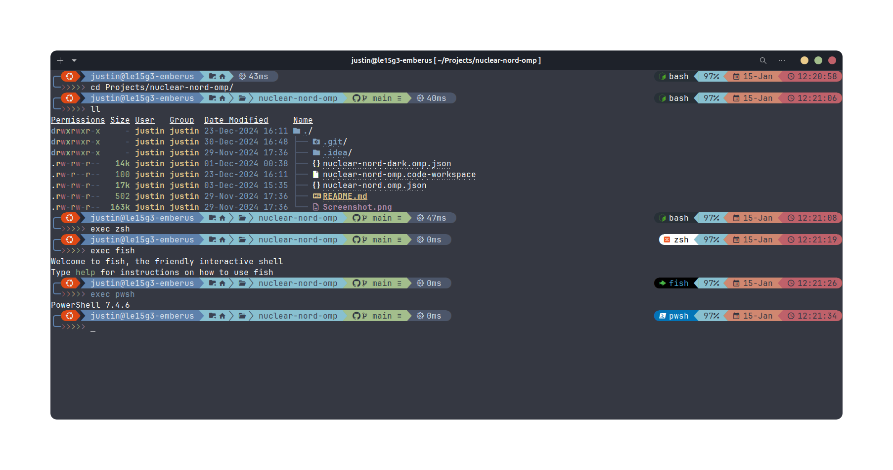

A modified version of the 'Atomic' theme that makes heavy use of the nord color palette and takes inspiration from AntonRyadovoy's 'nordcustom.omp.json' theme (https://github.com/AntonRyadovoy/pwsh_profile). Logo and color schemes will change in the OS segment and the Shell segment dynamically. Includes standard templates for JS, Python, AWS, Git, etc.

